<div align="center">



<br/>


<p>
Building secure, scalable, and thoughtful digital solutions —<br/>
at the intersection of software, networks, and security.
</p>

<a href="#featured-projects">
  
</a>
<a href="https://github.com/madalitso-saulos">
  
</a>

</div>

<br/>

<div align="center">

| Repositories | Commits | Technologies | Certifications |
|:---:|:---:|:---:|:---:|
|  |  |  |  |

</div>


## About

```bash
name      Madalitso Saulos
role      Software Developer · Network Engineer · Cybersecurity Student
focus     Secure systems, resilient networks, clean code
now       Studying cybersecurity while shipping full-stack & network tooling
status    Open to collaboration on open-source security & dev projects
```

<br/>

<div align="center">
<sub>Securing systems, one commit at a time.</sub>
</div>
