<div align="center">



</div>

<div align="left">

# Madalitso Saulos


> Building secure, scalable, and innovative digital solutions through software engineering, networking, and cybersecurity.

<a href="#-featured-projects">
  
</a>
<a href="https://github.com/madalitso-saulos">
  
</a>

</div>

<br/>

<!-- ================= STATS STRIP ================= -->
<div align="center">

<table>
<tr>
<td align="center" width="25%">

</td>
<td align="center" width="25%">

</td>
<td align="center" width="25%">

</td>
<td align="center" width="25%">

</td>
</tr>
</table>

</div>


<!-- ================= ABOUT ================= -->
## `~$` whoami

```bash
> name         : Madalitso Saulos
> role         : Software Developer / Network Engineer / Cybersecurity Student
> focus        : Secure systems, resilient networks, clean code
> currently    : Studying cybersecurity while shipping full-stack + network tooling
> status       : Open to hiring or collaboration on open-source security & dev projects
```

<br/>
<sub> Securing systems, one commit at a time.</sub>
</div>

